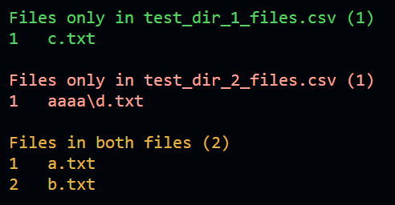

# GHD Compare Folders

Do you have two folders with a large number of files and you want to compare them?

## Usage

```bash
python find_files.py folder1 folder1_files.csv
python find_files.py folder2 folder2_files.csv
python compare_files.py folder1_files.csv folder2_files.csv
```

or

```bash
python compare_folders.py folder1 folder2
```

## Result 


